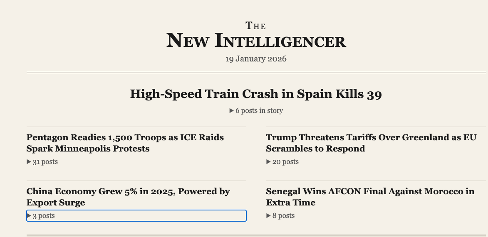

# The New Intelligencer

A daily newspaper generated from your Bluesky timeline.



The New Intelligencer transforms your Bluesky feed into a curated newspaper-style digest. It fetches posts from your timeline, groups related posts into stories, writes headlines, and compiles everything into a browsable HTML page.

## Quick Start

```bash
./run.sh
```

This runs the full workflow and generates `digest.html` in today's workspace folder.

## Setup

### Prerequisites

- Go 1.24+
- [Claude Code](https://github.com/anthropics/claude-code)
- Bluesky account with an app password

### Bluesky Credentials

1. In Bluesky, go to **Settings > Privacy and Security > App Passwords**
2. Create a new app password
3. Store your credentials in macOS Keychain:

```bash
security add-generic-password -s "bsky-agent" -a "handle" -w "your.handle.bsky.social"
security add-generic-password -s "bsky-agent" -a "password" -w "xxxx-xxxx-xxxx-xxxx"
```

### Build

```bash
make build
```

## How It Works

The digest is created through a six-stage pipeline:

```
FETCH → CATEGORIZE → CONSOLIDATE → FRONT PAGE → HEADLINES → COMPILE
```

Four Claude Code agents handle the editorial work:

| Agent | Role |
|-------|------|
| `bsky-section-categorizer` | Assigns posts to newspaper sections |
| `bsky-consolidator` | Groups posts about the same story together |
| `bsky-front-page-selector` | Picks the top stories for the front page |
| `bsky-headline-editor` | Writes headlines and sets story priorities |

### CLI Commands

```bash
./bin/digest init      # Initialize today's workspace
./bin/digest fetch     # Fetch posts from your timeline
./bin/digest status    # Check workflow progress
./bin/digest compile   # Generate the final digest
```

## Development

```bash
make build   # Build the binary
make test    # Run tests
make clean   # Clean build artifacts
```
